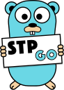

# Standard Template Package for GoLang

 Данный пакет для GoLang представляет собой реализацию различных паттернов ООП (для самообразования) для сокращения трудозатрат при разработки програмного обеспечения.

##### Реализовано:

* Массивы + паттерн Iterator
* Очереди FIFO
* HashMap + паттерн Iterator (с сортировкой по ключам или значениям)
* Механизм преобразования данных (с возможностью замены стандартных методов int <-> float32 и т.д.)

# Лицензия / License

This package is open-sourced software licensed under the [LICENSE](./LICENSE).
