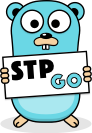

# Standard Template Package for GoLang

 Данный пакет для GoLang представляет собой реализацию различных паттернов ООП (для самообразования) для сокращения трудозатрат при разработки програмного обеспечения.

##### Реализовано:

* Массивы + паттерн Iterator
* Очереди FIFO
* Механизм преобразования данных

# License

This package is open-sourced software licensed under the [LICENSE](./LICENSE).
